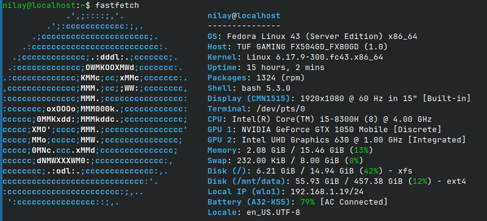
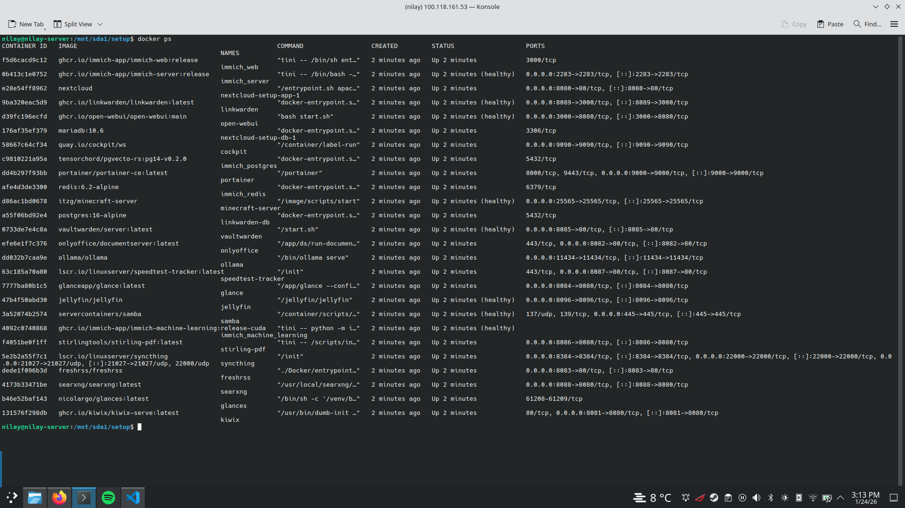

# Nilay’s Home Lab Stack

This repository documents the setup and configuration of a **fully self-hosted Docker homelab** running on a Debian/Ubuntu-based server.

The stack provides:

- **Private Cloud:** Nextcloud (Storage), Linkwarden (Bookmarks), Vaultwarden (Passwords)
- **AI & Intelligence:** Ollama (Backend), Open WebUI (Frontend)
- **Media & Content:** Jellyfin (Streaming), Immich (Photos), FreshRSS (Feeds), Kiwix (Offline Wiki)
- **Media Automation (Arrs):** Sonarr (TV), Radarr (Movies), Lidarr (Music), Bazarr (Subtitles), Prowlarr (Indexers)
- **Downloads:** SABnzbd (Usenet), qBittorrent (Torrents), RDTClient (Debrid)
- **Productivity:** ONLYOFFICE (Docs), Stirling PDF (PDF Tools), Syncthing (Sync)
- **System & Tools:** Cockpit, Portainer, Glance, Speedtest Tracker, SearXNG, FlareSolverr, Home Assistant, n8n, Nginx Proxy Manager

All services are orchestrated using **Docker Compose** with environment variables managed via a `.env` file for security and portability.

---

## Services Overview

| Service          | Container Name          | Host Port     | Purpose                           | Status         |
| ---------------- | ----------------------- | ------------- | --------------------------------- | -------------- |
| **Nextcloud**    | `nextcloud-setup-app-1` | `8080`        | Private cloud storage & file sync | ✅ Operational |
| **ONLYOFFICE**   | `onlyoffice`            | `8082`        | Document editing for Nextcloud    | ✅ Integrated  |
| **Immich**       | `immich_server`         | `2283`        | Self-hosted photo & video backup  | ✅ Operational |
| **Jellyfin**     | `jellyfin`              | `8096`        | Media streaming server            | ✅ Operational |
| **Open WebUI**   | `open-webui`            | `3000`        | Local LLM chat interface          | ✅ Operational |
| **Ollama**       | `ollama`                | `11434` (API) | Local AI model backend            | ✅ Operational |
| **Glance**       | `glance`                | `8084`        | Startpage / Dashboard             | ✅ Operational |
| **Vaultwarden**  | `vaultwarden`           | `8085`        | Password Manager (Bitwarden)      | ✅ Operational |
| **Stirling PDF** | `stirling-pdf`          | `8086`        | PDF Manipulation Tools            | ✅ Operational |
| **Speedtest**    | `speedtest-tracker`     | `8087`        | Internet speed tracking history   | ✅ Operational |
| **SearXNG**      | `searxng`               | `8088`        | Privacy-respecting metasearch     | ✅ Operational |
| **Linkwarden**   | `linkwarden`            | `8089`        | Bookmark & Web Archive manager    | ✅ Operational |
| **Syncthing**    | `syncthing`             | `8384`        | Obsidian vault & file sync        | ✅ Operational |
| **KIWIX**        | `kiwix`                 | `8081`        | Offline Wikipedia & Arch Wiki     | ✅ Operational |
| **FreshRSS**     | `freshrss`              | `8083`        | RSS feed reader                   | ✅ Operational |
| **Cockpit**      | `cockpit`               | `9090`        | Web-based server management       | ✅ Operational |
| **Samba**        | `samba`                 | `445`         | LAN file sharing                  | ✅ Operational |
| **Portainer**    | `portainer`             | `9000`        | Docker management UI              | ✅ Operational |
| **Minecraft**    | `minecraft-server`      | `25565`       | Minecraft Java server (Paper)     | ✅ Operational |
| **SABnzbd**      | `sabnzbd`               | `8180`        | Usenet downloader                 | ✅ Operational |
| **qBittorrent**  | `qbittorrent`           | `8090`        | Torrent downloader                | ✅ Operational |
| **RDTClient**    | `rdtclient`             | `6500`        | Real-Debrid downloader            | ✅ Operational |
| **Sonarr**       | `sonarr`                | `8989`        | TV Series management              | ✅ Operational |
| **Radarr**       | `radarr`                | `7878`        | Movie management                  | ✅ Operational |
| **Lidarr**       | `lidarr`                | `8686`        | Music management                  | ✅ Operational |
| **Bazarr**       | `bazarr`                | `6767`        | Subtitle management               | ✅ Operational |
| **Prowlarr**     | `prowlarr`              | `9696`        | Indexer management                | ✅ Operational |
| **FlareSolverr** | `flaresolverr`          | `8191`        | Proxy for indexers                | ✅ Operational |

---

## Prerequisites

Before deploying this stack on a new machine, ensure:

1. **Operating System** Debian / Ubuntu / Linux Mint (tested on Debian-based systems)
2. **Docker**

- Docker Engine installed
- Docker Compose plugin installed

3. **NVIDIA GPU (Recommended)**

- NVIDIA drivers installed
- `nvidia-container-toolkit` configured (required for Immich ML & Ollama)

4. **Data Drive**

- Primary data drive **must be mounted at `/mnt/sda1**`

---

## Installation & Setup

This stack uses a `.env` file to manage configuration, ensuring secrets are not hardcoded.

1. **Clone the Repository**

```bash
git clone <this-repo>
cd <this-repo>

```

2. **Configure Environment Variables**
   Copy the example file to a production file:

```bash
cp .env.example .env

```

_Edit the `.env` file to set your passwords, specific paths, and generated keys._ 3. **Deploy the Stack**

```bash
docker compose up -d

```

---

## Directory Structure (Host Volumes)

All persistent data lives under `/mnt/sda1`. The exact paths are configurable in `.env`, but default to:

| Host Path                 | Service Data                             |
| ------------------------- | ---------------------------------------- |
| `/mnt/sda1/setup/`        | Docker Compose files & config            |
| `/mnt/sda1/nextcloud/`    | Nextcloud app + database                 |
| `/mnt/sda1/ai/`           | Ollama models & Open WebUI data          |
| `/mnt/sda1/immich/`       | Immich photos, DB, ML cache              |
| `/mnt/sda1/onlyoffice/`   | ONLYOFFICE data & cache                  |
| `/mnt/sda1/jellyfin/`     | Jellyfin config & cache                  |
| `/mnt/sda1/vaultwarden/`  | Vaultwarden database                     |
| `/mnt/sda1/linkwarden/`   | Linkwarden data & DB                     |
| `/mnt/sda1/stirling-pdf/` | Stirling PDF configs & logs              |
| `/mnt/sda1/speedtest/`    | Speedtest Tracker history                |
| `/mnt/sda1/searxng/`      | SearXNG config                           |
| `/mnt/sda1/syncthing/`    | Syncthing config & vault                 |
| `/mnt/sda1/freshrss/`     | FreshRSS data                            |
| `/mnt/sda1/glance/`       | Glance dashboard config                  |
| `/mnt/sda1/minecraft/`    | Minecraft server data                    |
| `/mnt/sda1/media/`        | Media libraries (Torrents, Usenet, etc.) |
| `/mnt/sda1/arrs/`         | Configuration for Arrs apps              |

---

## Access Links

Use **local IP** or **Tailscale IP / hostname**.

| Service                 | URL                                   |
| ----------------------- | ------------------------------------- |
| **Nextcloud**           | `https://nextcloud.nilay-server.com/` |
| **ONLYOFFICE**          | `https://docs.nilay-server.com/`      |
| **Immich**              | `https://photos.nilay-server.com/`    |
| **Jellyfin**            | `https://media.nilay-server.com/`     |
| **Open WebUI**          | `https://ai.nilay-server.com/`        |
| **Glance (Dashboard)**  | `https://home.nilay-server.com/`      |
| **Vaultwarden**         | `https://vault.nilay-server.com/`     |
| **Stirling PDF**        | `https://pdf.nilay-server.com/`       |
| **Speedtest**           | `https://speed.nilay-server.com/`     |
| **SearXNG**             | `https://search.nilay-server.com/`    |
| **Linkwarden**          | `https://links.nilay-server.com/`     |
| **Cockpit**             | `https://cockpit.nilay-server.com/`   |
| **Portainer**           | `https://docker.nilay-server.com/`    |
| **Syncthing**           | `https://sync.nilay-server.com/`      |
| **Kiwix**               | `https://kiwix.nilay-server.com/`     |
| **FreshRSS**            | `https://rss.nilay-server.com/`       |
| **Sonarr**              | `https://tv.nilay-server.com/`        |
| **Radarr**              | `https://movies.nilay-server.com/`    |
| **Lidarr**              | `https://music.nilay-server.com/`     |
| **qBittorrent**         | `https://torrent.nilay-server.com/`   |
| **n8n**                 | `https://n8n.nilay-server.com/`       |
| **Home Assistant**      | `https://hass.nilay-server.com/`      |
| **Nginx Proxy Manager** | `http://<ip>:81`                      |

---

## Nextcloud Maintenance Notes

If Nextcloud login or file operations break (usually after proxy testing), run:

```bash
# Clear file locks
docker exec nextcloud-setup-db-1 \
  mysql -u root -p${NEXTCLOUD_DB_ROOT_PASSWORD} \
  -e "DELETE FROM nextcloud.oc_file_locks WHERE 1;"

# Remove stale proxy settings
docker exec --user www-data nextcloud-setup-app-1 php occ config:system:delete overwriteprotocol
docker exec --user www-data nextcloud-setup-app-1 php occ config:system:delete trusted_proxies

```

---

## Documentation Links

| Service               | Documentation URL                                                                                                                  |
| --------------------- | ---------------------------------------------------------------------------------------------------------------------------------- |
| **Nextcloud**         | [https://docs.nextcloud.com/](https://docs.nextcloud.com/)                                                                         |
| **Immich**            | [https://immich.app/docs/](https://www.google.com/search?q=https://immich.app/docs/)                                               |
| **Jellyfin**          | [https://jellyfin.org/docs/](https://jellyfin.org/docs/)                                                                           |
| **Open WebUI**        | [https://docs.openwebui.com/](https://docs.openwebui.com/)                                                                         |
| **Linkwarden**        | [https://docs.linkwarden.app/](https://docs.linkwarden.app/)                                                                       |
| **Vaultwarden**       | [https://github.com/dani-garcia/vaultwarden/wiki](https://www.google.com/search?q=https://github.com/dani-garcia/vaultwarden/wiki) |
| **Stirling PDF**      | [https://github.com/Stirling-Tools/Stirling-PDF](https://github.com/Stirling-Tools/Stirling-PDF)                                   |
| **Speedtest Tracker** | [https://docs.linuxserver.io/images/docker-speedtest-tracker/](https://docs.linuxserver.io/images/docker-speedtest-tracker/)       |
| **SearXNG**           | [https://docs.searxng.org/](https://docs.searxng.org/)                                                                             |
| **Glance**            | [https://github.com/glanceapp/glance](https://github.com/glanceapp/glance)                                                         |
| **Syncthing**         | [https://docs.syncthing.net/](https://docs.syncthing.net/)                                                                         |
| **Cockpit**           | [https://cockpit-project.org/guide/latest/](https://cockpit-project.org/guide/latest/)                                             |
| **Servarr (Arrs)**    | [https://wiki.servarr.com/](https://wiki.servarr.com/)                                                                             |

---

## Screenshots / Rice




