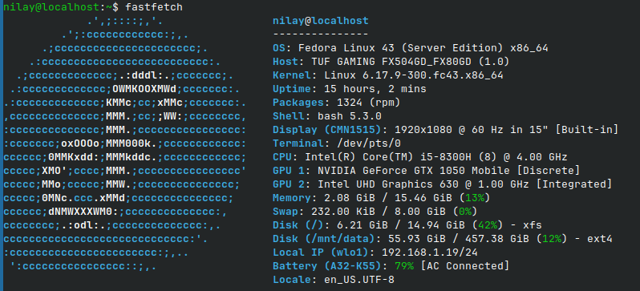
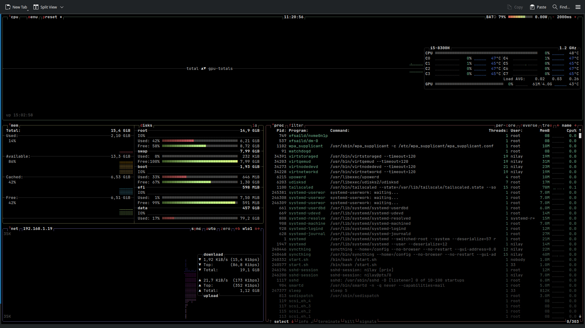
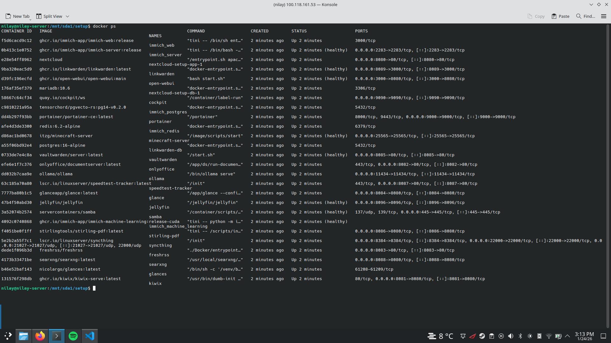

#  Nilay's Home Lab Stack

This repository documents the setup and configuration for a fully functional, self-hosted Docker stack running on a Debian server. This stack provides private cloud storage, a local AI chat engine, Obsidian notes sync, KIWIX offline wikipedia vault and Syncthing for file sharing.

## Services Overview

All services are run via Docker Compose and are configured to communicate over the internal Docker network. External access is currently handled via direct **HTTP ports**.

| Service | Container Name | Host Port | Function | Status |
| :--- | :--- | :--- | :--- | :--- |
| **Nextcloud** | `nextcloud-setup-app-1` | `8080` | Private Cloud Storage | Operational (HTTP) |
| **AI Chatbot** | `open-webui` | `3000` | Local LLM Chat Interface | Operational (HTTP) |
| **Syncthing [For Obsidian]** | `syncthing` | `8384` | File Sync and Obsidian Vault set up (HTTP) |
| **Ollama** | `ollama` | Internal | Local AI Model Backend | Operational |
| **KIWIX Server** | `kiwix` | `8081` | Offline Wikipedia and Arch Wiki vault |


-----

## Prerequisites

Before launching the stack on a new machine, ensure the following are installed and configured:

1.  **Operating System:** Debian/Ubuntu/Linux Mint
2.  **Docker & Compose:** Docker Engine and Docker Compose Plugin installed.
3.  **Tailscale:** Installed and running (for secure remote access).
4.  **Data Drive:** The primary data drive **must be mounted to `/mnt/sda1`**.

## The "One-Click" Setup Script

To easily migrate or restore the entire environment, use the provided `conf.sh` script.

**Steps:**

1.  Clone this repository to your new machine.
2.  Ensure your data drive is mounted at `/mnt/sda1`.
3.  Give the script execution permission: `chmod +x conf.sh`
4.  Run the script: `./conf.sh`

-----

## Directory Structure (Host Volumes)

All persistent data for the services are mapped to directories under `/mnt/sda1`:

| Host Path | Purpose |
| :--- | :--- |
| `/mnt/sda1/nextcloud-setup` | Contains `docker-compose.yml` and `setup_my_stack.sh`. **The project root.** |
| `/mnt/sda1/nextcloud/` | All Nextcloud files and database storage. |
| `/mnt/sda1/ai/` | Stores Ollama models and Open WebUI user data. |
| `/mnt/sda1/kiwix/` | Stores kiwix databases for wikipedia (English) and Arch Wiki. |


## Access Links

All services are accessible on the local network. For remote access, use your **Tailscale IP** or **Tailscale Hostname**.

| Service | URL (Local/Tailscale) | Login/Notes |
| :--- | :--- | :--- |
| **Syncthing** | `http://<ip-address>:8384` | Syncthing for Obsidian vault and possible cloud saves for games |
| **Nextcloud** | `http://<ip-address>:8080` | Use your Nextcloud user credentials. |
| **AI Chatbot** | `http://<ip-address>:3000` | Log in with Open WebUI admin credentials. |
| **Kiwix** | `http://<ip-address>:8081` | Kiwix access page. |

-----

## Screenshots [The Rice]




## Key Configuration Files

The entire stack is defined in the single **`docker-compose.yml`** file located in the root of this project.

### Nextcloud Fixes

Due to previous reverse proxy testing, if Nextcloud fails to log in, you must use these commands to clear stale settings:

```bash
# Clear file locks (useful after mobile app issues)
sudo docker exec nextcloud-setup-db-1 mysql -u root -pstrongpassword123 -e "DELETE FROM nextcloud.oc_file_locks WHERE 1;"

# Reset proxy and protocol settings (run after any proxy issues)
sudo docker exec --user www-data nextcloud-setup-app-1 php occ config:system:delete overwriteprotocol
sudo docker exec --user www-data nextcloud-setup-app-1 php occ config:system:delete trusted_proxies
```

